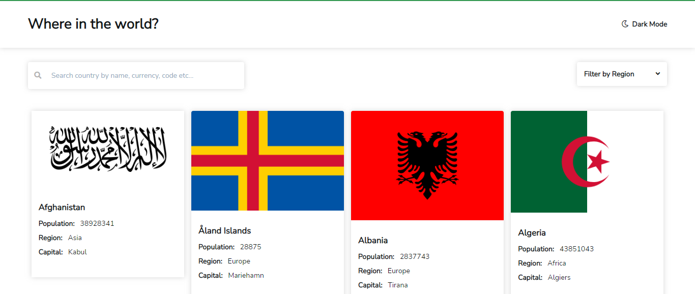

# Frontend Mentor - E-commerce product page solution

This is a solution to the [E-commerce product page challenge on Frontend Mentor](https://www.frontendmentor.io/challenges/ecommerce-product-page-UPsZ9MJp6). Frontend Mentor challenges help you improve your coding skills by building realistic projects.

## Table of contents

- [Overview](#overview)
  - [The challenge](#the-challenge)
  - [Screenshot](#screenshot)
  - [Links](#links)
- [My process](#my-process)
  - [Built with](#built-with)
  - [What I learned](#what-i-learned)
  - [Continued development](#continued-development)
- [Author](#author)
- [Acknowledgments](#acknowledgments)

## Overview

### The challenge

Users should be able to:

- View the optimal layout for the site depending on their device's screen size
- See hover states for all interactive elements on the page
- Open a lightbox gallery by clicking on the large product image
- Switch the large product image by clicking on the small thumbnail images
- Add items to the cart
- View the cart and remove items from it

### Screenshot

### Links

- Solution URL: https://github.com/nuel1/Country-searcher
- Live Site URL: https://zen-brown-c927a1.netlify.app

## My process

### Built with

- Semantic HTML5 markup
- CSS custom properties
- Flexbox
- CSS Grid
- Mobile-first workflow
- Vanilla Javascript

### What I learned

This project helped me experiment more on Javascript Regular expression. It gave me a huge boost in understanding of Regex.
This concept, useful and efficient for working with strings was immensely used in this project, helping me handle
strings and complicated tasks with ease...

Secondly, i learnt how to make a preloader for asynchronous task. Fetching and getting data aynchronously via third party API
usaully take some time to respond; therefore, i plotted out a content preloader for such purpose to give user a clear
idea that a specific content is loading...

Lastly, Intersection Observer: the javascript API that ushers smoother experience for mouse scroll actions was used in this
project to add content to the page as the user scrolls down the page...

### Continued development

In future projects, i look forward to gaining solid understanding of the workings of the Javascript API- Intersection Observer;
which would greatly solidify my experience in building quality and interactive web apps...

## Author

- Frontend Mentor - https://www.frontendmentor.io/profile/nuel1

## Acknowledgments

Thanks to frontend mentor .io for this incredible project idea.
